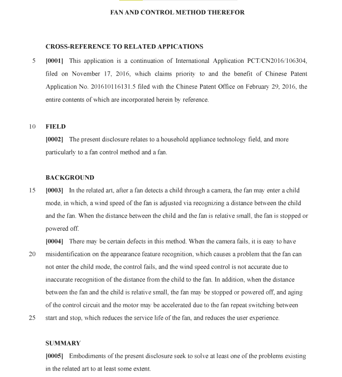

# Image to Word Converter using Tesseract in C++

This is a simple C++ program that uses Tesseract OCR (Optical Character Recognition) library to convert images containing text into editable word format. The program takes an input image, processes it using Tesseract, and then extracts the text from the image, saving the result to a word document.

## Prerequisites

Before running the program, make sure you have the following installed on your system:

1. C++ compiler (e.g., GCC, Clang, MSVC, etc.).
2. Tesseract OCR library. You can download it from: [tesseract](https://github.com/tesseract-ocr/tesseract)

## Dependencies

- Tesseract OCR library (with C++ bindings)

## Setup

1. Install Tesseract OCR library on your system.

2. Clone this repository and navigate to the project directory.

3. Place the input image file (containing text) in the project directory.

## How to Build
Compile the program Image-Word.cpp as normal C++ program.

## Sample output

## Usage

1. Place the input image file (e.g., "input_image.png") in the same directory as the compiled binary.

2. Run the program.

3. The program will process the image and extract the text from it.

4. The output will be saved in a word document named "output.docx" in the same directory.

## Example

Suppose you have an image named "sample_image.png" containing some text. After placing the image in the project directory, you can run the program. 

The program will process the "sample_image.png" and generate a "output_word.docx" file with the extracted text.

## Notes

- The program assumes that the input image contains English text. Tesseract supports various languages, but this program only works on English data. One can extend the capability by downloading the other languages data from [tessdata](https://github.com/tesseract-ocr/tessdata).
  
- For better OCR results, make sure the input image is clear and of decent resolution.

- The program may not provide 100% accurate results, as OCR is not perfect, especially for images with poor quality or complex fonts.

## License

This project is licensed under the [MIT License](LICENSE).
